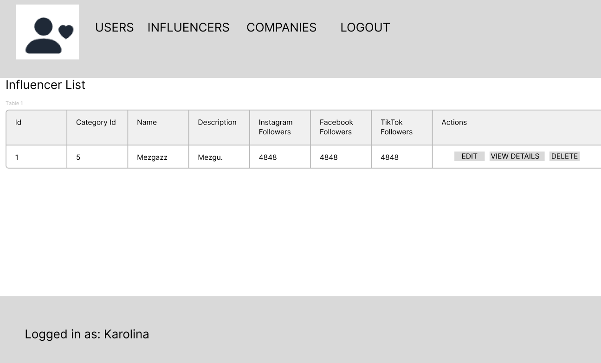

# Nuomonės formuotojų paieškos platforma

## Sistemos paskirtis:

Platformoje įmonės gali ieškoti tinkamų nuomonės formuotojų, skaitydami esamus atsiliepimus.

## Funkciniai reikalavimai:

* Įmonė gali palikti atsiliepimą apie nuomonės formuotoją ir atvirkščiai
* Įmonės gali perskaityti kitų (ir savo) paliktus atsiliepimus apie nuomonės formuotojus ir atvirkščiai
* Įmonė gali redaguoti savo profilį, pridėdama aktualią informaciją apie įmonės pasiekimus, aprašymą ir t.t.
* Nuomonės formuotojai gali redaguoti savo profilį, pridėdami aktualią informaciją apie sekėjų skaičių ir pan.

## Sistemos architektūra:
Žemiau esančiame paveiksle pateikta sistemos architektūra.


## Naudotojo sąsaja

Registracijos lango prototipas:


Realizuotas registracijos langas:


Prisijungimo lango prototipas:


Realizuotas prisijungimo langas:


Nuomonės formuotojų sąrašo peržiūros lango prototipas:


Realizuotas nuomonės formuotojų sąrašo peržiūros langas:


Nuomonės formuotojo profilio peržiūros lango prototipas:


Realizuotas nuomonės formuotojo profilio peržiūros langas:


Nuomonės formuotojo profilio kūrimo lango prototipas:


Realizuotas nuomonės formuotojo profilio kūrimo langas:


Nuomonės formuotojo profilio trynimo patvirtinimo lango prototipas:


Realizuotas nuomonės formuotojo profilio trynimo patvirtinimo langas:


## Technologijos:

* Loginiai komponentai realizuojami C# .NET karkasu
* Vaizdinė sąsaja realizuojama su TypeScript React biblioteka
* Loginiai ir vaizdiniai komponentai tarpusavyje bendrauja REST APIs
* Duomenų bazei naudojama MySQL sistema

## Objektai:

* Nuomonės formuotojo profilis: primary key id, external id userId, string name, string description, int igFollowersCount, int fbFollowersCount, int tiktokFollowersCount, external id category. 
* Įmonės profilis: primary key id, external id userId, string name, string description, float yearlyIncome
* Atsiliepimas: primary key id, external id influencerId, external id companyId, string description, int stars, boolean verified
* Kategorija: primary key id, string name. 

## Rolės:

* Rolės: Nuomonės formuotojas, Įmonė, Administratorius
* Visi useriai turi: primary key id, string username, string email, string password, boolean isDeleted

## OPENAPI dokumentacija


| Metodas | Kelias |
| --- | --- |
| GET | [/api/v1/category/{id}](#getapiv1categoryid) |
| PUT | [/api/v1/category/{id}](#putapiv1categoryid) |
| PATCH | [/api/v1/category/{id}](#patchapiv1categoryid) |
| DELETE | [/api/v1/category/{id}](#deleteapiv1categoryid) |
| GET | [/api/v1/category](#getapiv1category) |
| POST | [/api/v1/category](#postapiv1category) |
| GET | [/api/v1/companyprofile/{id}](#getapiv1companyprofileid) |
| PUT | [/api/v1/companyprofile/{id}](#putapiv1companyprofileid) |
| PATCH | [/api/v1/companyprofile/{id}](#patchapiv1companyprofileid) |
| DELETE | [/api/v1/companyprofile/{id}](#deleteapiv1companyprofileid) |
| GET | [/api/v1/companyprofile](#getapiv1companyprofile) |
| POST | [/api/v1/companyprofile](#postapiv1companyprofile) |
| GET | [/api/v1/influencerprofile/{id}](#getapiv1influencerprofileid) |
| PUT | [/api/v1/influencerprofile/{id}](#putapiv1influencerprofileid) |
| PATCH | [/api/v1/influencerprofile/{id}](#patchapiv1influencerprofileid) |
| DELETE | [/api/v1/influencerprofile/{id}](#deleteapiv1influencerprofileid) |
| GET | [/api/v1/influencerprofile](#getapiv1influencerprofile) |
| POST | [/api/v1/influencerprofile](#postapiv1influencerprofile) |
| GET | [/api/v1/review/{id}](#getapiv1reviewid) |
| PUT | [/api/v1/review/{id}](#putapiv1reviewid) |
| PATCH | [/api/v1/review/{id}](#patchapiv1reviewid) |
| DELETE | [/api/v1/review/{id}](#deleteapiv1reviewid) |
| GET | [/api/v1/review](#getapiv1review) |
| POST | [/api/v1/review](#postapiv1review) |
| GET | [/api/v1/review/company/{id}](#getapiv1reviewcompanyid) |
| GET | [/api/v1/review/influencer/{id}](#getapiv1reviewinfluencerid) |
| GET | [/api/v1/user/{id}](#getapiv1userid) |
| PUT | [/api/v1/user/{id}](#putapiv1userid) |
| PATCH | [/api/v1/user/{id}](#patchapiv1userid) |
| DELETE | [/api/v1/user/{id}](#deleteapiv1userid) |
| GET | [/api/v1/user](#getapiv1user) |
| POST | [/api/v1/user/influencer](#postapiv1userinfluencer) |
| POST | [/api/v1/user/company](#postapiv1usercompany) |
| POST | [/api/v1/user/login](#postapiv1userlogin) |
| POST | [/api/v1/user/accessToken](#postapiv1useraccesstoken) |
| POST | [/api/v1/user/logout](#postapiv1userlogout) |

## Nuorodų lentelė

| Pavadinimas | Kelias |
| --- | --- |
| CreateCategoryRequestDTO | [#/components/schemas/CreateCategoryRequestDTO](#componentsschemascreatecategoryrequestdto) |
| CreateCompanyProfileRequestDTO | [#/components/schemas/CreateCompanyProfileRequestDTO](#componentsschemascreatecompanyprofilerequestdto) |
| CreateInfluencerProfileRequestDTO | [#/components/schemas/CreateInfluencerProfileRequestDTO](#componentsschemascreateinfluencerprofilerequestdto) |
| CreateReviewRequestDTO | [#/components/schemas/CreateReviewRequestDTO](#componentsschemascreatereviewrequestdto) |
| CreateUserRequestDTO | [#/components/schemas/CreateUserRequestDTO](#componentsschemascreateuserrequestdto) |
| LoginUserRequestDTO | [#/components/schemas/LoginUserRequestDTO](#componentsschemasloginuserrequestdto) |
| PatchCategoryRequestDTO | [#/components/schemas/PatchCategoryRequestDTO](#componentsschemaspatchcategoryrequestdto) |
| PatchCompanyProfileRequestDTO | [#/components/schemas/PatchCompanyProfileRequestDTO](#componentsschemaspatchcompanyprofilerequestdto) |
| PatchInfluencerProfileRequestDTO | [#/components/schemas/PatchInfluencerProfileRequestDTO](#componentsschemaspatchinfluencerprofilerequestdto) |
| PatchReviewRequestDTO | [#/components/schemas/PatchReviewRequestDTO](#componentsschemaspatchreviewrequestdto) |
| PatchUserRequestDTO | [#/components/schemas/PatchUserRequestDTO](#componentsschemaspatchuserrequestdto) |
| PutCategoryRequestDTO | [#/components/schemas/PutCategoryRequestDTO](#componentsschemasputcategoryrequestdto) |
| PutCompanyProfileRequestDTO | [#/components/schemas/PutCompanyProfileRequestDTO](#componentsschemasputcompanyprofilerequestdto) |
| PutInfluencerProfileRequestDTO | [#/components/schemas/PutInfluencerProfileRequestDTO](#componentsschemasputinfluencerprofilerequestdto) |
| PutReviewRequestDTO | [#/components/schemas/PutReviewRequestDTO](#componentsschemasputreviewrequestdto) |
| PutUserRequestDTO | [#/components/schemas/PutUserRequestDTO](#componentsschemasputuserrequestdto) |

## Kelio detalės

***

### [GET]/api/v1/category/{id}

#### Responses

- 200 Success

- 401 Unauthorized

- 404 Not Found

***

### [PUT]/api/v1/category/{id}

#### RequestBody

- application/json

```ts
{
  name: string
  followersCountFrom: integer
  followersCountTo: integer
}
```

```

#### Responses

- 200 Success

- 401 Unauthorized

- 404 Not Found

- 422 Unproccessable Content

***

### [PATCH]/api/v1/category/{id}

#### RequestBody

- application/json

```ts
{
  name?: string
  followersCountFrom?: integer
  followersCountTo?: integer
}
```


#### Responses

- 200 Success

- 401 Unauthorized

- 404 Not Found

- 422 Unproccessable Content

***

### [DELETE]/api/v1/category/{id}

#### Responses

- 204 No content

- 401 Unauthorized

- 404 Not Found

- 409 Conflict

***

### [GET]/api/v1/category

#### Responses

- 200 Success

- 401 Unauthorized

- 404 Not Found

***

### [POST]/api/v1/category

#### RequestBody

- application/json

```ts
{
  name: string
  followersCountFrom: integer
  followersCountTo: integer
}
```


#### Responses

- 201 Created

- 401 Unauthorized

- 422 Unprocessable Content

***

### [GET]/api/v1/companyprofile/{id}

#### Responses

- 200 Success

- 401 Unauthorized

- 404 Not Found

***

### [PUT]/api/v1/companyprofile/{id}

#### RequestBody

- application/json

```ts
{
  name: string
  description?: string
  yearlyIncome?: number
}
```


#### Responses

- 200 Success

- 401 Unauthorized

- 404 Not Found

- 422 Unproccessable Content

***

### [PATCH]/api/v1/companyprofile/{id}

#### RequestBody

- application/json

```ts
{
  name?: string
  description?: string
  yearlyIncome?: number
}
```


#### Responses

- 200 Success

- 401 Unauthorized

- 403 Forbid

- 404 Not Found

***

### [DELETE]/api/v1/companyprofile/{id}

#### Responses

- 204 No content

- 401 Unauthorized

- 403 Forbid

- 404 Not Found

***

### [GET]/api/v1/companyprofile

#### Responses

- 200 Success

- 401 Unauthorized

- 404 Not Found

***

### [POST]/api/v1/companyprofile

#### RequestBody

- application/json

```ts
{
  name: string
  description?: string
  yearlyIncome?: number
}
```


#### Responses

- 201 Created

- 401 Unauthorized

- 422 Unprocessable Content

***

### [GET]/api/v1/influencerprofile/{id}

#### Responses

- 200 Success

- 401 Unauthorized

- 403 Forbid

- 404 Not Found

***

### [PUT]/api/v1/influencerprofile/{id}

#### RequestBody

- application/json

```ts
{
  categoryId?: integer
  name?: string
  description?: string
  igFollowerCount?: integer
  fbFollowerCount?: integer
  tiktokFollowerCount?: integer
}
```


#### Responses

- 200 Success

- 401 Unauthorized

- 403 Forbid

- 404 Not Found

***

### [PATCH]/api/v1/influencerprofile/{id}

#### RequestBody

- application/json

```ts
{
  categoryId?: integer
  name?: string
  description?: string
  igFollowerCount?: integer
  fbFollowerCount?: integer
  tiktokFollowerCount?: integer
}
```


#### Responses

- 200 Success

- 401 Unauthorized

- 403 Forbid

- 404 Not Found

***

### [DELETE]/api/v1/influencerprofile/{id}

#### Responses

- 204 No content

- 401 Unauthorized

- 403 Forbid

- 404 Not Found

***

### [GET]/api/v1/influencerprofile

#### Responses

- 200 Success

- 401 Unauthorized

- 404 Not Found

***

### [POST]/api/v1/influencerprofile

#### RequestBody

- application/json

```ts
{
  categoryId?: integer
  name?: string
  description?: string
  igFollowerCount?: integer
  fbFollowerCount?: integer
  tiktokFollowerCount?: integer
}
```


#### Responses

- 201 Created

- 401 Unauthorized

- 422 Unprocessable Content

***

### [GET]/api/v1/review/{id}

#### Responses

- 200 Success

- 401 Unauthorized

- 404 Not Found

***

### [PUT]/api/v1/review/{id}

#### RequestBody

- application/json

```ts
{
  name?: string
  description?: string
  stars?: integer
  verified?: boolean
}
```


#### Responses

- 200 Success

- 401 Unauthorized

- 403 Forbid

- 404 Not Found

***

### [PATCH]/api/v1/review/{id}

#### RequestBody

- application/json

```ts
{
  name?: string
  description?: string
  stars?: integer
  verified?: boolean
}
```


#### Responses

- 200 Success

- 401 Unauthorized

- 403 Forbid

- 404 Not Found

***

### [DELETE]/api/v1/review/{id}

#### Responses

- 204 No content

- 401 Unauthorized

- 403 Forbid

- 404 Not Found

***

### [GET]/api/v1/review

#### Responses

- 200 Success

- 401 Unauthorized

- 404 Not Found

***

### [POST]/api/v1/review

#### RequestBody

- application/json

```ts
{
  influencerId?: string
  companyId?: string
  userId?: string
  name?: string
  description?: string
  stars?: integer
}
```


#### Responses

- 201 Created

- 401 Unauthorized

***

### [GET]/api/v1/review/company/{id}

#### Responses

- 200 Success

- 400 Bad Request

- 401 Unauthorized

- 404 Not Found

***

### [GET]/api/v1/review/influencer/{id}

#### Responses

- 200 Success

- 400 Bad Request

- 401 Unauthorized

- 404 Not Found

***

### [GET]/api/v1/user/{id}

#### Responses

- 200 Success

- 401 Unauthorized

- 404 Not Found

***

### [PUT]/api/v1/user/{id}

#### RequestBody

- application/json

```ts
{
  name?: string
  email?: string
  password?: string
  phone?: string
  isDeleted?: boolean
}
```


#### Responses

- 200 Success

- 401 Unauthorized

- 403 Forbid

- 404 Not Found

***

### [PATCH]/api/v1/user/{id}

#### RequestBody

- application/json

```ts
{
  name?: string
  email?: string
  password?: string
  phone?: string
  isDeleted?: boolean
}
```


#### Responses

- 200 Success

- 401 Unauthorized

- 403 Forbid

- 404 Not Found

***

### [DELETE]/api/v1/user/{id}

#### Responses

- 204 No Content

- 401 Unauthorized

- 403 Forbid

- 404 Not Found

***

### [GET]/api/v1/user

#### Responses

- 200 Success

- 401 Unauthorized

***

### [POST]/api/v1/user/influencer

#### RequestBody

- application/json

```ts
{
  userName?: string
  password?: string
  email?: string
}
```


#### Responses

- 201 Created

- 401 Unauthorized

- 422 Unprocessable Content

***

### [POST]/api/v1/user/company

#### RequestBody

- application/json

```ts
{
  userName?: string
  password?: string
  email?: string
}
```


#### Responses

- 201 Created

- 401 Unauthorized

- 422 Unprocessable Content

***

### [POST]/api/v1/user/login

#### RequestBody

- application/json

```ts
{
  userName?: string
  password?: string
}
```


#### Responses

- 200 Success

- 401 Unauthorized

- 422 Unprocessable Content

***

### [POST]/api/v1/user/accessToken

#### Responses

- 200 Success

- 401 Unauthorized

- 422 Unprocessable Content

***

### [POST]/api/v1/user/logout

#### Responses

- 200 Success

- 401 Unauthorized

- 422 Unprocessable Content

## References

### #/components/schemas/CreateCategoryRequestDTO

```ts
{
  name: string
  followersCountFrom: integer
  followersCountTo: integer
}
```

### #/components/schemas/CreateCompanyProfileRequestDTO

```ts
{
  name: string
  description?: string
  yearlyIncome?: number
}
```

### #/components/schemas/CreateInfluencerProfileRequestDTO

```ts
{
  categoryId?: integer
  name?: string
  description?: string
  igFollowerCount?: integer
  fbFollowerCount?: integer
  tiktokFollowerCount?: integer
}
```

### #/components/schemas/CreateReviewRequestDTO

```ts
{
  influencerId?: string
  companyId?: string
  userId?: string
  name?: string
  description?: string
  stars?: integer
}
```

### #/components/schemas/CreateUserRequestDTO

```ts
{
  userName?: string
  password?: string
  email?: string
}
```

### #/components/schemas/LoginUserRequestDTO

```ts
{
  userName?: string
  password?: string
}
```

### #/components/schemas/PatchCategoryRequestDTO

```ts
{
  name?: string
  followersCountFrom?: integer
  followersCountTo?: integer
}
```

### #/components/schemas/PatchCompanyProfileRequestDTO

```ts
{
  name?: string
  description?: string
  yearlyIncome?: number
}
```

### #/components/schemas/PatchInfluencerProfileRequestDTO

```ts
{
  categoryId?: integer
  name?: string
  description?: string
  igFollowerCount?: integer
  fbFollowerCount?: integer
  tiktokFollowerCount?: integer
}
```

### #/components/schemas/PatchReviewRequestDTO

```ts
{
  name?: string
  description?: string
  stars?: integer
  verified?: boolean
}
```

### #/components/schemas/PatchUserRequestDTO

```ts
{
  name?: string
  email?: string
  password?: string
  phone?: string
  isDeleted?: boolean
}
```

### #/components/schemas/PutCategoryRequestDTO

```ts
{
  name: string
  followersCountFrom: integer
  followersCountTo: integer
}
```

### #/components/schemas/PutCompanyProfileRequestDTO

```ts
{
  name: string
  description?: string
  yearlyIncome?: number
}
```

### #/components/schemas/PutInfluencerProfileRequestDTO

```ts
{
  categoryId?: integer
  name?: string
  description?: string
  igFollowerCount?: integer
  fbFollowerCount?: integer
  tiktokFollowerCount?: integer
}
```

### #/components/schemas/PutReviewRequestDTO

```ts
{
  name?: string
  description?: string
  stars?: integer
  verified?: boolean
}
```

### #/components/schemas/PutUserRequestDTO

```ts
{
  name?: string
  email?: string
  password?: string
  phone?: string
  isDeleted?: boolean
}
```


## Darbo išvados

1. Sukurta serverio dalies programa su .NET, leidžianti klientinei daliai bendrauti REST API užklausomis.
2. Duomenų bazės sprendimui panaudotas MySQL.
3. Klientinė dalis realizuota su React ir TypeScript.
4. Autorizacijai panaudoti JWT tokenai.
5. Puslapis pasiekiamas tinklu ir yra patalpintas fiziniame serveryje.